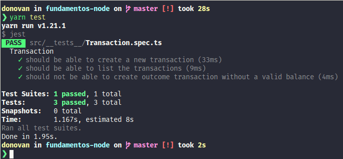

<h1 align="center">
  Challenge 05: First Node.js project
</h1>

Template from [Rocketseat](https://github.com/Rocketseat/bootcamp-gostack-desafios/edit/master/desafio-fundamentos-nodejs/)

### About the challenge

The basic template for this project is available at the following url: [Access Template](https://github.com/Rocketseat/gostack-template-fundamentos-node)

This is an application for storing incoming and outgoing financial transactions, which allows the registration and listing of these transactions.

# License

This project is under the MIT license. See the [LICENSE](./LICENSE) file for more details.
